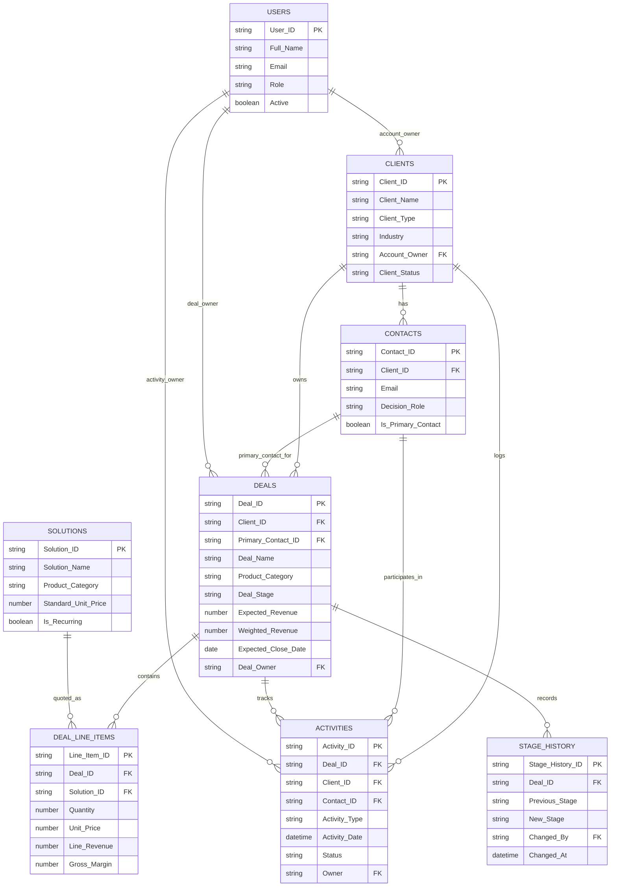

# Matchpoint Technology Sales Management Web App

This repository contains the initial Google Apps Script (GAS) foundation and Google Sheets database design for Matchpoint Technology's internal Sales Management Web App.

## Google Sheets Database Schema

Use one Google Spreadsheet as the application's database. Create the following sheets with the exact headers shown below in row 1.

### Clients

Stores company/account records.

| Column Header | Purpose |
| --- | --- |
| Client ID | Unique client key, e.g. `CLI-0001`. |
| Client Name | Legal or trading name of the client company. |
| Client Type | Prospect, Customer, Partner, Vendor, or Reseller. |
| Industry | Client industry or vertical. |
| Website | Company website URL. |
| Main Phone | Main company telephone number. |
| Billing Address | Billing address. |
| Shipping Address | Primary delivery or project address. |
| City | Client city. |
| State/Province | Client state or province. |
| Country | Client country. |
| Postal Code | Client postal code. |
| Account Owner | Internal Matchpoint Technology owner. |
| Lead Source | Referral, Website, Event, Cold Outreach, Existing Customer, etc. |
| Client Status | Active, Inactive, On Hold, or Archived. |
| Notes | General account notes. |
| Created At | Timestamp when the client was created. |
| Updated At | Timestamp when the client was last updated. |

### Contacts

Stores individual contacts related to clients.

| Column Header | Purpose |
| --- | --- |
| Contact ID | Unique contact key, e.g. `CON-0001`. |
| Client ID | Foreign key to `Clients.Client ID`. |
| First Name | Contact first name. |
| Last Name | Contact last name. |
| Job Title | Contact role/title. |
| Department | Contact department. |
| Email | Work email address. |
| Phone | Direct phone number. |
| Mobile | Mobile phone number. |
| Preferred Contact Method | Email, Phone, Mobile, Video Call, or In Person. |
| Decision Role | Decision Maker, Influencer, Technical Evaluator, Finance, User, etc. |
| Is Primary Contact | TRUE when this is the main contact for the client. |
| Contact Status | Active, Inactive, Left Company, or Do Not Contact. |
| LinkedIn URL | LinkedIn profile URL. |
| Notes | Contact-specific notes. |
| Created At | Timestamp when the contact was created. |
| Updated At | Timestamp when the contact was last updated. |

### Solutions

Stores sellable products, services, and solution offerings.

| Column Header | Purpose |
| --- | --- |
| Solution ID | Unique solution key, e.g. `SOL-0001`. |
| Solution Name | Name of the product, service, or solution. |
| Product Category | RFID Technology, Hardware, Custom Software, Integration Services, Support, Consulting, etc. |
| Description | Short description of the offering. |
| Unit Type | License, Device, Project, Hour, Month, Subscription, or Bundle. |
| Standard Unit Price | Default unit price. |
| Cost Estimate | Estimated unit cost or delivery cost. |
| Currency | Currency code such as USD. |
| Is Recurring | TRUE when revenue is recurring. |
| Billing Frequency | One-Time, Monthly, Quarterly, Annual, or Milestone. |
| Active | TRUE when available for active deals. |
| Notes | Internal notes. |
| Created At | Timestamp when the solution was created. |
| Updated At | Timestamp when the solution was last updated. |

### Deals

Stores sales opportunities and pipeline data.

| Column Header | Purpose |
| --- | --- |
| Deal ID | Unique deal key, e.g. `DEA-0001`. |
| Client ID | Foreign key to `Clients.Client ID`. |
| Primary Contact ID | Foreign key to `Contacts.Contact ID`. |
| Deal Name | Opportunity name. |
| Product Category | Primary category such as RFID Technology, Hardware, or Custom Software. |
| Deal Stage | New Lead, Qualified, Discovery, Solution Design, Proposal Sent, Negotiation, Verbal Commit, Closed Won, Closed Lost, or On Hold. |
| Probability % | Win probability as a percentage. |
| Expected Revenue | Expected deal value before probability weighting. |
| Weighted Revenue | Expected Revenue multiplied by Probability %. |
| Currency | Currency code such as USD. |
| Expected Close Date | Forecast close date. |
| Deal Owner | Internal Matchpoint Technology sales owner. |
| Lead Source | Source that generated the opportunity. |
| Priority | Low, Medium, High, or Strategic. |
| Next Step | Immediate next action. |
| Next Follow-Up Date | Date of the next planned follow-up. |
| Competitor | Known competitor, if any. |
| Pain Points | Client problems or business drivers. |
| Proposed Solution Summary | Summary of the proposed solution. |
| Loss Reason | Required when Deal Stage is Closed Lost. |
| Closed Date | Actual close date for won/lost deals. |
| Notes | Deal-specific notes. |
| Created At | Timestamp when the deal was created. |
| Updated At | Timestamp when the deal was last updated. |

### Deal Line Items

Stores one or more quoted solutions per deal.

| Column Header | Purpose |
| --- | --- |
| Line Item ID | Unique line item key, e.g. `DLI-0001`. |
| Deal ID | Foreign key to `Deals.Deal ID`. |
| Solution ID | Foreign key to `Solutions.Solution ID`. |
| Solution Name Snapshot | Solution name copied at the time of quoting. |
| Product Category Snapshot | Product category copied at the time of quoting. |
| Quantity | Quantity proposed. |
| Unit Price | Quoted unit price. |
| Discount % | Discount percentage. |
| Line Revenue | Quantity multiplied by Unit Price after discount. |
| Cost Estimate | Estimated cost for this line. |
| Gross Margin | Line Revenue minus Cost Estimate. |
| Billing Frequency | One-Time, Monthly, Quarterly, Annual, or Milestone. |
| Notes | Line item notes. |
| Created At | Timestamp when the line item was created. |
| Updated At | Timestamp when the line item was last updated. |

### Activities

Stores sales interactions, tasks, and follow-ups.

| Column Header | Purpose |
| --- | --- |
| Activity ID | Unique activity key, e.g. `ACT-0001`. |
| Deal ID | Optional foreign key to `Deals.Deal ID`. |
| Client ID | Foreign key to `Clients.Client ID`. |
| Contact ID | Optional foreign key to `Contacts.Contact ID`. |
| Activity Type | Call, Email, Meeting, Demo, Site Visit, Proposal, Task, or Note. |
| Subject | Short activity title. |
| Activity Date | Date/time the activity occurred or is due. |
| Due Date | Due date for tasks/follow-ups. |
| Completed Date | Completion date. |
| Status | Planned, Completed, Cancelled, or Deferred. |
| Owner | Internal person responsible. |
| Outcome | Result of the interaction. |
| Next Action | Follow-up action from this activity. |
| Notes | Activity details. |
| Created At | Timestamp when the activity was created. |
| Updated At | Timestamp when the activity was last updated. |

### Users

Stores internal users who own accounts, deals, and activities.

| Column Header | Purpose |
| --- | --- |
| User ID | Unique internal user key, e.g. `USR-0001`. |
| Full Name | User full name. |
| Email | Work email address. |
| Role | Sales Rep, Sales Manager, Admin, Engineer, or Executive. |
| Territory | Sales territory or segment. |
| Active | TRUE when the user is active. |
| Created At | Timestamp when the user was created. |
| Updated At | Timestamp when the user was last updated. |

### Stage History

Stores an audit trail for deal stage changes.

| Column Header | Purpose |
| --- | --- |
| Stage History ID | Unique stage-history key, e.g. `STH-0001`. |
| Deal ID | Foreign key to `Deals.Deal ID`. |
| Previous Stage | Stage before the change. |
| New Stage | Stage after the change. |
| Changed By | User who changed the stage. |
| Changed At | Timestamp of the stage change. |
| Reason/Notes | Reason or context for the change. |

## Mermaid.js Entity-Relationship Diagram



## Google Apps Script Backend Functions

`Code.gs` exposes the initial backend operations for the web app. Each CRUD function returns a standard response object:

```javascript
{
  status: 'success' | 'error',
  data: {},
  message: ''
}
```

### Web App Entry Point

- `doGet(e)` renders the `Index.html` interface with `HtmlService.createTemplateFromFile()`.

### CRUD API

- `createRecord(sheetKey, record)` creates a new row, auto-generates the sheet-specific primary key when omitted, sets `Created At` and `Updated At` when those headers exist, and rejects duplicate IDs.
- `readRecords(sheetKey, options)` reads rows with optional `id`, exact-match `filters`, `offset`, and `limit` options.
- `getRecordById(sheetKey, id)` reads one row by the sheet's configured primary key.
- `updateRecord(sheetKey, id, updates)` updates an existing row by ID and refreshes `Updated At` when the header exists.
- `deleteRecord(sheetKey, id)` deletes an existing row by ID.
- `getPipelineDashboardData()` returns Deals enriched with `Client Name`, a sorted list of deal stages for filtering, and dashboard metrics for total expected revenue and closed-won deal count.

Use the keys from `SHEET_NAMES` when calling these functions, for example `CLIENTS`, `DEALS`, or `DEAL_LINE_ITEMS`.
